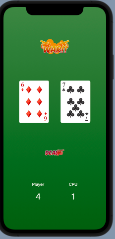

# War Sample app 
Want to always play *War!*, but do not have a friend to play it with? No worries! Now you can with this exciting app. Play against the computer any time you like with this iOS app, which runs on any Apple device. 

This app is based on the 14-day [Code with Chris](https://learn.codewithchris.com/) challenge. Assets and materials taken from that course, while this app was developed by following along with it. Highly recommend it! Sign up, so you can see how to build this app yourself. Otherwise, if that is too much work, then install Xcode on your Mac, clone this repository, and double-click the `.xcodeproj` file to open this up in Xcode to play the app locally yourself. From there, you can hit the play button in the top of Xcode to launch this app in a simulator, or even download it to your iPhone for seven days (Apple's limit, if you do not possess a developer's license at $99).
